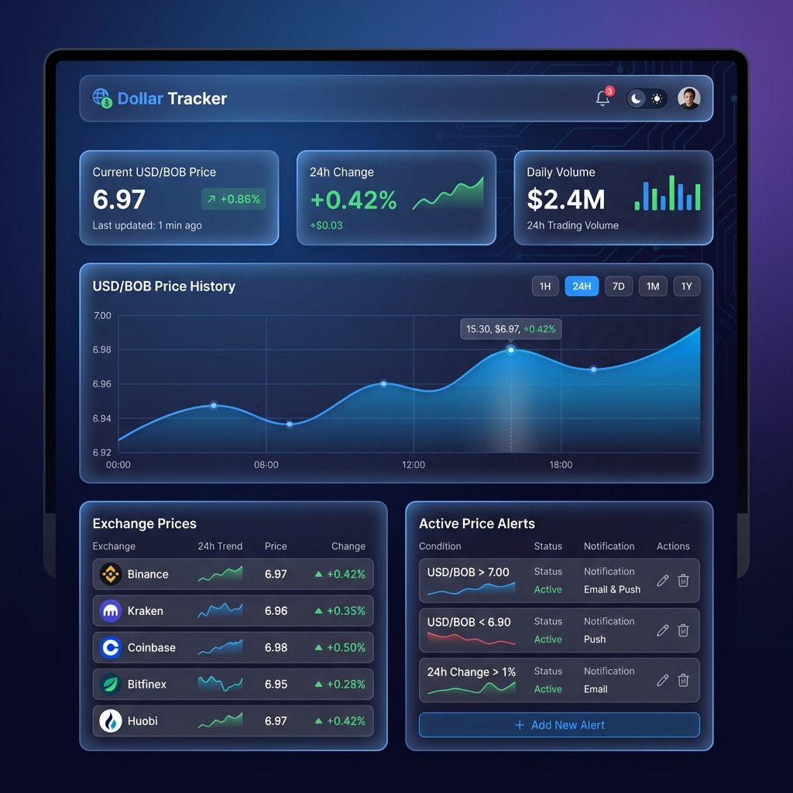

# Mockups - Dollar Tracker

Esta carpeta contiene los mockups de diseño para cada pantalla de la aplicación.

## 📱 Pantallas

### 1. Dashboard Principal

**Elementos:**
- Header con logo y controles (notificaciones, tema)
- 3 cards de métricas principales (precio actual, cambio 24h, volumen)
- Gráfico de línea con histórico de precios
- Lista de exchanges con precios en tiempo real
- Panel de alertas activas

---

### 2. Página de Gráficos

**Elementos:**
- Selector de exchange
- Botones de intervalo temporal (1H, 4H, 24H, 7D, 1M)
- Gráfico candlestick principal (OHLC)
- Gráfico comparativo de exchanges
- Sidebar con estadísticas (precio actual, high/low, volumen, volatilidad)

---

### 3. Página de Reportes

**Elementos:**
- Configuración de reporte (fechas, exchanges, tipo)
- Selector de formato (PDF/Excel)
- Vista previa del reporte
- Tabla de reportes recientes con descarga

---

### 4. Configuración y Alertas
*(Pendiente de generar)*

**Elementos planificados:**
- Lista de alertas activas con toggle
- Formulario para nueva alerta
- Configuración de notificaciones

---

## 🎨 Guía de Estilo

| Elemento | Color |
|----------|-------|
| Background | `#0f0f23` → `#1a1a2e` |
| Cards | Glassmorphism con blur |
| Accent | `#3b82f6` (azul) |
| Success | `#10b981` (verde) |
| Danger | `#ef4444` (rojo) |
| Text Primary | `#f1f5f9` |
| Text Secondary | `#94a3b8` |
